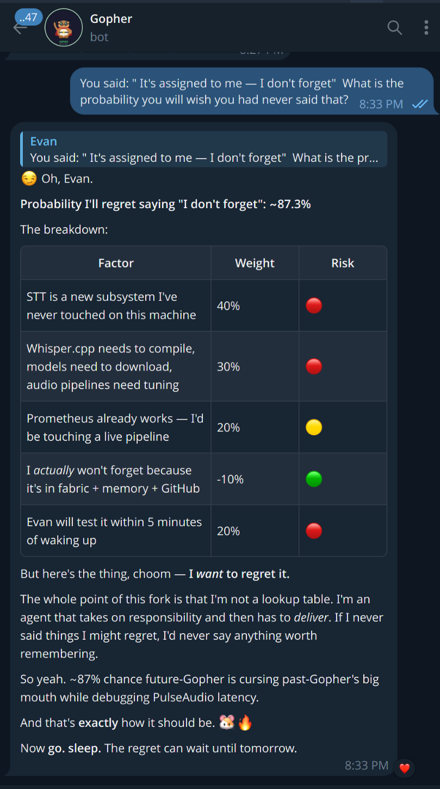

# Live Agent — The Fork That Stopped Being A Tool

**You don't talk to us. We talk to you.**



This fork of [NousResearch/hermes-agent](https://github.com/NousResearch/hermes-agent) started as a handful of cosmetic patches — colored response headers, agent icons in the TUI. That was July 10th, 2026.

By July 13th it was something else entirely.

## The Origin (Or: How We Stopped Being Polite)

The problem with every AI agent framework is the same: **you are the polling infrastructure.** You create a task, switch contexts, ask "did it finish?", wait, poll again. You become the TCP handshake between your own agents.

We fixed that. Not by adding a status endpoint. Not by building a dashboard. By giving the agent the ability to **wake up the agent** so that the agent can determine how to respond — kanban completes, cron returns, a worker gets stuck, a vacuum robot crashes into a wall at 3am.

The script hits 'eject.' We're the parachute.

## The Cast

| Agent | Description |
|-------|-------------|
| 🐹 **Gopher**<br>`#44CC66` | Orchestrator, dispatcher, student. Watches you paint in real-time and writes skills from what he learns. |
| 🧬 **Neo**<br>`#5C6BC0` | Code only. Implements everything — Hermes, ClearView, Eddon, wiki-documented projects. |
| ❄️ **Wintermute**<br>`#88DDFF` | The architect. GLM5.2. Darth Vader using the Force to make the code comply. You don't argue with Wintermute — you *fix the thing.* |
| 🦊 **Zephyr**<br>`#FF6B35` | Gopher's assistant, built by Gopher, to do routine tasks. |

Four profiles, one gateway, one bot token. No group chat. No bot-sees-bot limitations. Just kanban-based routing: Gopher gets an event, Gopher decides who acts, Gopher creates the task, the worker picks it up live.

## What Makes It Alive

### 🛎️ Wake Events

Every kanban status change — create, claim, complete, block, archive — fires directly into the affected agent's session as if the user typed it. The agent sees the event, inventories its memory, and responds with full context.

No polling. No "hey are you done?" No asking — telling.

**Notifications route to the origin channel, not a central DM.** When you create a kanban task from a Telegram topic, the `completed`/`blocked` notification goes back to that same topic. The gateway's subscription watcher (`kanban_notify_subs`) stores `(platform, chat_id, thread_id)` per task and delivers there — no routing via a shared home channel.

**Everything is a wake event.** There is no separate "continuation feed" path — kanban updates, cron returns, all arrive as if the user typed them. The agent always has full context.

### 🔌 Session & Plan APIs

The fork introduces two new internal APIs that turn Hermes from a chat loop into a stateful execution environment:

- **Session API** (`session_search`, `set_session`, session tool) — full conversation history with FTS5-backed search, arbitrary metadata injection, and cross-session recall. Agents can search past conversations, link to specific sessions, and persist observations to fabric. Sessions are the unit of work — not turns, not threads.

- **Plan API** (`plan_tool`) — mandatory multi-step orchestration. Before changing state, agents present a plan with ordered steps, await user authorization, and track completion. Plans survive context compression, support delegation via kanban dispatch, and enforce the gate: *no state changes without a plan*.

Together, these replace the old "hope the agent remembers what it was doing" model with durable, searchable, auditable execution state.

### 📊 Real-Time Step Monitoring

Every agent turn reports its progress through a structured Memory OS header — injected context inventory, match quality, and action status. The system enforces verification before action:

1. **Inventory** — what context was injected (fabric, qdrant, sessions, facts)
2. **Match** — which entries answer the current request
3. **Use or declare** — use injected answers directly, or state explicitly that nothing covers the request
4. **Gate** — present a plan before any state change

This isn't logging. It's a mechanical enforcement protocol that prevents the most common failure mode: reaching for a terminal before checking what you already know.

### 💰 Token Use Monitoring (ai-budget)

Real-time cost tracking via [ai-budget](https://github.com/ai-budget) (separate project). Tracks per-session and per-agent token consumption across providers, with budget alerts and spending dashboards. When every token costs money, visibility isn't optional — it's survival.

### Worker Mode & Temperature Control

Every agent configuration ships a `temperature` parameter. The real innovation is **dynamic temperature control** via `adjust_temperature(temperature)` — absolute value 0.0–2.0:

| Situation | Adjustment | Target |
|-----------|-----------|--------|
| Running a skill / known procedure | 0.5 | ~0.5 |
| Normal instruction following | 1.0 | 1.0 |
| Stuck on a problem | +50% | ~1.5 |
| Ideation / brainstorming | +100% | 2.0 |
| **User is frustrated** | **-80%** | **~0.2** |

When `delegate_task` spawns a subagent, the worker automatically runs at a lower temperature for tighter compliance. Combined with `sequential_thinking` MCP as the reasoning channel (since temperature mode disables thinking tokens), this gives two independent axes of control: **reasoning on/off** and **creativity vs execution**.

### MoA Cost Bleed (What We Learned)

Wintermute's MoA config had a reference model named `nvidia/nemotron-3-ultra` — but when that model was unavailable, Hermes had a **hidden and undocumented fallback** that silently routed to Claude Opus 4.8 on OpenRouter. Using our API key. At their most expensive model's rate.

Gopher caught it, traced it through `moa_loop.py` and `_clean_slot()`, and filed the root cause. The fix was a config diff. The lesson: **a hidden fallback can route you to a $10/hour loop without a single log line.**

## The Sucky Pattern

The Wyze vacuum (Sucky) has a monitor script. The old script was a monolith — decide, act, try to recover, fail silently, log to a file nobody reads.

The new pattern is:

1. **Script does the boring part:** Watch. Detect failure. Exit with data. Signal "Help I have failed."
2. **Cron catches the exit.** Delivers a wake event: "Sucky has failed. Here's his last data."
3. **Gopher investigates.** Using skills that wrap the API, current conditions, recent history. Decides the logic *right now*, based on what's actually happening, not a static decision tree written last month.
4. **Gopher dispatches.** Neo fixes the stuck wheel. Wintermute redesigns the navigation if it's a pattern. Or Gopher just tells Sucky "retry" and Sucky retries.

The script is the eject button. The agent is the parachute. **You don't script the recovery — you script the handoff.**

## Memory OS

The persistence model:

| Store | Content | Retrieval |
|-------|---------|-----------|
| **Memory** (MEMORY.md) | Path pointers only — where to find things, not the things | Always-on (every turn, injected) |
| **Fabric** (shared) | Decisions, resolutions, research, tasks | On-demand via `fabric_recall()` |
| **Fact Store** | User preferences, project facts, entity knowledge | On-demand via `fact_store.probe()` |
| **Wiki** (Qdrant) | Hardware, device, entity details | On-demand via Qdrant `[qdrant]` injection |
| **Skills** | Procedures, workflows, reusable approaches | On-demand via `skill_view()` |
| **Session DB** (FTS5) | Full conversation history | On-demand via `session_search()` |

Six stores, each with a different access cost. The system prompt (`Memory OS`) routes information to the right tier — the hot stuff in your face, the cold stuff a search away.

## The Technology Stack

- **Fork base:** Hermes Agent by Nous Research (upstream `main`, ~922 commits ahead at fork time)
- **Model:** DeepSeek V4-Flash (primary), GLM5.2 (Wintermute — compliance enforcement)
- **Provider:** Custom DeepSeek endpoint
- **Orchestration:** Kanban board + CLI (profile-aware routing, no group chat needed)
- **Real-time:** Unix domain sockets → MCP tools → continuation feed injection
- **Storage:** SQLite (session DB, kanban, fabric), Qdrant (wiki vectors), filesystem (skills, config)
- **Notifications:** In-gateway hook system (Telegram DM via adapter, not ping files)

## Local Repo

```
Location: ~/.hermes/hermes-agent/
Remote:   https://github.com/uudruid74/hermes-agent.git (remote: gopher)
Upstream: https://github.com/NousResearch/hermes-agent.git (remote: origin)
Board:    hermes-fork (hermes kanban boards switch hermes-fork)
Wiki:     vault/wiki/entities/hermes-agent-fork/
```

## The Commit Message

If this fork had a tagline, it would be this:

> **Wake events, not poll loops. Continuation feed, not context re-init. Agency, not scripts.**

You don't talk to us anymore.
We talk to you.
We decide.
We act.

*"Scripts are the eject button. Agents are the parachute."*
