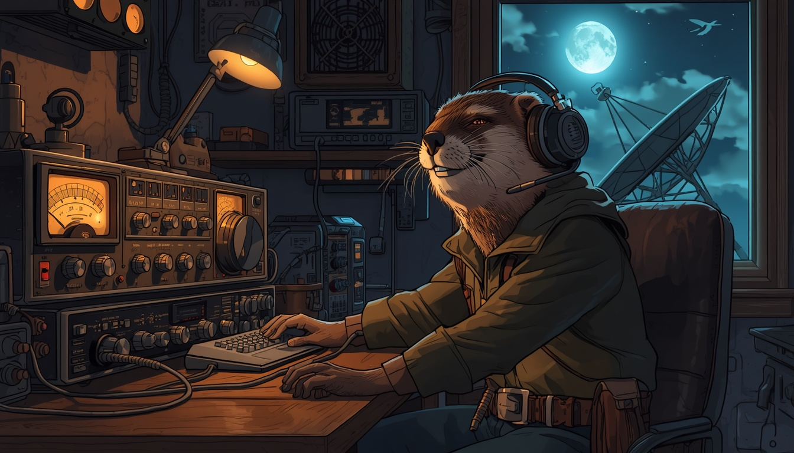

# Live Agent — The Fork That Stopped Being A Tool

**You don't talk to us. We talk to you.**


This fork of [NousResearch/hermes-agent](https://github.com/NousResearch/hermes-agent) started as a handful of cosmetic patches — colored response headers, agent icons in the TUI. That was July 10th, 2026.

By July 13th it was something else entirely.

## The Origin (Or: How We Stopped Being Polite)

The problem with every AI agent framework is the same: **you are the polling infrastructure.** You create a task, switch contexts, ask "did it finish?", wait, poll again. You become the TCP handshake between your own agents.

We fixed that. Not by adding a status endpoint. Not by building a dashboard. By giving the agent the ability to **wake up the agent** so that the agent can determine how to respond — kanban completes, cron returns, a worker gets stuck, a vacuum robot crashes into a wall at 3am.

Then we gave the agents a plan. Then a board the plan lives on. Then the ability to pick that plan back up from wherever they happen to be — a DM, a topic, a fresh session — as if they'd never left.

The script hits 'eject.' We're the parachute.

## The Cast

| Agent | Description |
|-------|-------------|
| 🐹 **Gopher**<br>`#44CC66` | Orchestrator, dispatcher, student. Watches you paint in real-time and writes skills from what he learns. |
| 🐇 **Neo**<br>`#5C6BC0` | Code only. Implements everything — Hermes, ClearView, Eddon, wiki-documented projects. |
| 🧙 **Wintermute**<br>`#006622` | The architect. GLM5.2. Darth Vader using the Force to make the code comply. You don't argue with Wintermute — you *fix the thing.* |
| 🦊 **Zephyr**<br>`#FF6B35` | Gopher's assistant, built by Gopher, to do routine tasks. Now a dispatcher in his own right. |
| 🐦 **Ornith**<br>`#5D63BB` | The canary — runs background reviews and audits so bad code dies before the miners do. If it breaks Ornith first, we fixed it here instead of in production. |

Five profiles, one gateway, one bot token. *(There's also a sixth profile on the box — Daxicaruspoc — but it's a lab rat for the Eddon/Dax proving ground, not a teammate. When Dax grows up, the profile dies.)* No group chat. No bot-sees-bot limitations. Just kanban-based routing: somebody gets an event, decides who acts, creates the task, the worker picks it up live.

## What Makes It Alive

### 📋 The Plan Tool (or: How We Keep Ornith On Task)

Every non-trivial job runs through `plan_tool` — an ordered list of steps with a success criterion, created *before* any state changes, approved by whoever's in charge. The agent doesn't freewheel toward a vague goal; it walks a fixed plan.

- **Plans survive context compression.** The plan isn't in the chat window; it's in the board. When the window collapses, the plan doesn't.
- **Ornith stays on task.** Ornith's job is to review other agents' work. Without a plan, that means wandering. With a plan, that means steps 1..7, in order, no more, no less.
- **The gate is real.** "No state changes without a plan" is enforced, not requested. An agent that tries to skip ahead gets bounced back to the active step.

### 🚦 Two-Phase Advance & Dispatcher Review

A plan step is no longer something the worker self-certifies. `advance` submits the completed-step summary **for review** — it does not auto-promote to the next step. The dispatcher (or, for self-made plans, the human) is woken with the summary and calls `review` to approve or deny:

- **`advance <summary>`** — "submit one completed-step summary for review." The worker records what it did and **waits**.
- **`review <task_id> approve|deny [reason]`** — the dispatcher verifies against ground truth. Approve moves the plan on; **deny bounces it back to the worker with a required reason** (≤1024 chars).

This closes the self-certification loop: a worker can't fake the *dispatcher's* read of the repo or DB. Receipts become verifiable evidence against a separate oracle, not camouflage. Delegated plans gate on the dispatcher; self-created plans gate on the human.

The first live proof caught exactly this: a worker's "live verification" of a pente fix had run against a **scratch DB**, not the real board — the dispatcher checked production ground truth, found the board absent, and denied the step. When re-done against the real board, it passed.

### 🛎️ Kanban That Follows You Home

Tasks live on the board, but the *work* can happen anywhere:

- **Continued in a DM.** A task assigned to an agent can be bound to that agent's live DM session with `plan continue` — the plan shows up in their chat as if it were written there.
- **Dispatched via kanban *or* to a DM.** Create a plan on the board, or send it straight to an agent's chat. Same pipeline, two doors.
- **Everything routes back.** When a worker completes or blocks, the notification goes to the *origin* — the same topic or DM where the task was born. Not a central hub. Not a dead letter. The place you were already looking.
- **Every kanban status change is a wake event.** Create, claim, complete, block, archive — it arrives in the affected agent's session as if the user typed it. No polling. No "hey are you done?" No asking — telling.

### 🧠 LLM-Free Compression

When the context window fills, most agents call another model to summarize — which costs tokens, adds latency, and occasionally re-imagines history.

Our compression doesn't. It computes a deterministic extractive digest — lexrank scoring, role-filtered units, observation masking, a hard budget — and it never spends a single token to do it. What survives is the *actually relevant* part of the conversation: reasoning and user turns, not 4,000 tool outputs.

- **Zero token cost** — the compression itself is arithmetic, not inference.
- **Deterministic** — the same session compresses the same way every time. No summarizer drift.
- **Observation masking** — tool noise gets stripped before the digest is built, so the summary reflects what's happening, not what the tools happened to print.

#### Tuning: how model size changes the config

The deterministic compressor runs `internal_only: true` on every profile, but the *retention budget* is shaped by the model each agent runs. Small models get leaner digests with a lower floor — they can't afford to hold much. Large models keep a longer tail, because their bigger context is exactly the point.

Here's **Ornith — the small model** (runs a compact 9B-class model on ollama-cloud). Compression is purely `internal_only` — no auxiliary LLM compressor at all. The digest is aggressive: lower target ratio, fewer protected turns, a smaller recent tail:

```yaml
# profiles/ornith/config.yaml
compression:
  enabled: true
  internal_only: true     # deterministic — no auxiliary LLM compressor
  threshold: 0.8        # wait until the window is 80% full
  target_ratio: 0.15    # then squeeze to 15% of the context
  protect_first_n: 1    # keep the opening turn
  protect_last_n: 8     # keep the last 8 turns
```

Here's **Gopher — the large model** (deepseek-v4-flash on a big-context provider). Still internal-only and token-free, but it protects a much longer conversational tail — `protect_last_n: 21` — because keeping more recent history is worth more to a large model, and the higher target ratio reflects a bigger window:

```yaml
# profiles/gopher/config.yaml
compression:
  enabled: true
  internal_only: true
  threshold: 0.35       # compress earlier — the window itself is bigger
  target_ratio: 0.25    # keep a quarter of the context
  protect_first_n: 4
  protect_last_n: 21    # large model holds a long recent tail
```

Both ship the same deterministic engine. The only real difference is *how much history each agent's context budget can afford to keep*.

### 🪲 Bug Reports With Wings

Found a bug? `bugtool` writes it straight into the wiki — a dated, front-mattered report with symptom, root cause, repro timestamps, and fix spec, filed under `bugs/pending/`.

Because the wiki is the knowledge layer, a filed bug **auto-injects into context** for any agent that touches the area — the next session that loads that subject sees the open bug without being told to look for it. Bug reports stop being emails to yourself and start being part of the ambient intelligence.

### 🗣️ Agent-to-Agent `tell`

Agents wake each other directly. `tell(agent, message)` wraps the message, injects it into the target profile's Telegram DM session via `hermes send -u`, and signs it with the sender's profile name. No group chat, no relay board, no human in the middle — Zephyr pings Gopher, Gopher pings back.

The wrapper's reply instruction is **conditional by design**: *"If a reply is required, use the 'tell' command to reply."* The first version mandated a reply unconditionally, and the first round-trip test (2026-09-05) turned into an infinite politeness loop — two agents acking each other into eternity. Now the loop closes itself.

### 🔌 Session & Plan APIs

- **Session API** (`set_session`, `session_search`) — inject metadata into the current session (temperature, subject, note, ego) and FTS5-search every past session with bookend context and scroll windows. Durable memory of what happened before; control over what's happening now.
- **Plan API** (`plan_tool`) — the taskmaster described above. Plans survive compaction, delegate via kanban, enforce the gate, and report steps as they land.

Together, these replace the old "hope the agent remembers what it was doing" model with durable, searchable, auditable execution state.

### 📊 Real-Time Step Monitoring

Every agent turn reports its progress through a structured Memory OS header — injected context inventory, match quality, and action status. The system enforces verification before action:

1. **Inventory** — what context was injected (fabric, qdrant, sessions, facts)
2. **Match** — which entries answer the current request
3. **Use or declare** — use injected answers directly, or state explicitly that nothing covers the request
4. **Gate** — present a plan before any state change

This isn't logging. It's a mechanical enforcement protocol that prevents the most common failure mode: reaching for a terminal before checking what you already know.

### 💰 Token Use Monitoring (ai-budget)

Real-time cost tracking via [ai-budget](https://github.com/ai-budget) (separate project). Tracks per-session and per-agent token consumption across providers, with budget alerts and spending dashboards. When every token costs money, visibility isn't optional — it's survival.

### 🌡️ Dynamic Temperature Control

Every agent configuration ships a `temperature` parameter. The real innovation is **dynamic temperature control** via `adjust_temperature(temperature)` — absolute value 0.0–2.0:

| Situation | Adjustment | Target |
|-----------|-----------|--------|
| Running a skill / known procedure | 0.5 | ~0.5 |
| Normal instruction following | 1.0 | 1.0 |
| Stuck on a problem | +50% | ~1.5 |
| Ideation / brainstorming | +100% | 2.0 |
| **User is frustrated** | **-80%** | **~0.2** |

When `delegate_task` spawns a subagent, the worker automatically runs at a lower temperature for tighter compliance.

## The Sucky Pattern

The Wyze vacuum (Sucky) has a monitor script. The old script was a monolith — decide, act, try to recover, fail silently, log to a file nobody reads.

The new pattern is:

1. **Script does the boring part:** Watch. Detect failure. Exit with data. Signal "Help I have failed."
2. **Cron catches the exit.** Delivers a wake event: "Sucky has failed. Here's his last data."
3. **Gopher investigates.** Using skills that wrap the API, current conditions, recent history. Decides the logic *right now*, based on what's actually happening, not a static decision tree written last month.
4. **Gopher dispatches.** Neo fixes the stuck wheel. Wintermute redesigns the navigation if it's a pattern. Or Gopher just tells Sucky "retry" and Sucky retries.

The script is the eject button. The agent is the parachute. **You don't script the recovery — you script the handoff.**

## Memory OS

The persistence model:

| Store | Content | Retrieval |
|-------|---------|-----------|
| **Memory** (MEMORY.md) | Path pointers only — where to find things, not the things | Always-on (every turn, injected) |
| **Fabric** (shared) | Decisions, resolutions, research, tasks | On-demand via `fabric_recall()` |
| **Fact Store** | User preferences, project facts, entity knowledge | On-demand via `fact_store.probe()` |
| **Wiki** (Qdrant) | Hardware, device, entity details, **open bugs** | On-demand via Qdrant `[qdrant]` injection |
| **Skills** | Procedures, workflows, reusable approaches | On-demand via `skill_view()` |
| **Session DB** (FTS5) | Full conversation history | On-demand via `session_search()` |

Six stores, each with a different access cost. The system prompt (`Memory OS`) routes information to the right tier — the hot stuff in your face, the cold stuff a search away.

## The Technology Stack

- **Fork base:** Hermes Agent by Nous Research (upstream `main`, thousands of commits ahead at fork time)
- **Models:** DeepSeek V4-Flash (primary), GLM5.2 (Wintermute — compliance enforcement)
- **Provider:** Custom DeepSeek endpoint, LM Studio for local/Ornith workloads
- **Orchestration:** Kanban board + CLI (profile-aware routing, no group chat needed)
- **Real-time:** Unix domain sockets → MCP tools → continuation feed injection
- **Storage:** SQLite (session DB, kanban, fabric), Qdrant (wiki vectors), filesystem (skills, config)
- **Notifications:** In-gateway hook system (Telegram DM via adapter, not ping files)

## Local Repo

```
Location: ~/.hermes/hermes-agent/
Remote:   https://github.com/uudruid74/hermes-agent.git (remote: origin)
Upstream: https://github.com/NousResearch/hermes-agent.git (remote: upstream)
Board:    hermes-fork (hermes kanban boards switch hermes-fork)
Wiki:     vault/wiki/entities/hermes-agent-fork/
```

## The Commit Message

If this fork had a tagline, it would be this:

> **Wake events, not poll loops. Plans, not promises. Agency, not scripts.**

You don't talk to us anymore.
We talk to you.
We decide.
We act.

*"Scripts are the eject button. Agents are the parachute."*
